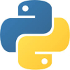

<div align = "center">
    
</div>

# Herramientas Python.

*Herramientas Python* es un conjunto de notebooks de aprendizaje sobre las librerías fundamentales para los cursos de *Cálculo Numérico* y *Ciencia de Datos* en [*Python*](https://www.python.org).

<a href="https://nbviewer.jupyter.org/github/ejdecena/herramientas_python/tree/master/"></a>  

## Desarrollador.

* [Ing. Edgard Decena.](mailto:edecena@gmail.com)

## Indice de contenido.

* [**Numpy**](01_numpy.ipynb): Librería para el manejo y cálculo numérico de matrices y vectores.
* [**Matplotlib**](02_matplotlib.ipynb): Librería para la visualización de datos en 2D y 3D.
* [**Scipy**](03_scipy.ipynb): Librería que contiene distintos algoritmos de cálculo numérico y optimización.
* [**Pandas**](04_pandas.ipynb): Librería para el procesamiento de datos.
* [**Statsmodels**](05_statsmodels.ipynb): Librería para el análisis y cálculo numérico de funciones estadísticas.
* [**Scikit Learn**](06_scikit_learn.ipynb): Librería para el desarrollo de modelos de *Aprendizaje Automático*.

## Dependencias.

Este proyecto requiere la instalación de las siguientes dependencias externas:

* *Jupyter 1.0.0* (`$ pip install jupyter`)
* *Numpy 1.16.4* (`$ pip install numpy`)
* *Matplotlib 3.0.3* (`$ pip install matplotlib`)
* *Seaborn 0.9.0* (`$ pip install seaborn`)
* *Scipy 1.3.0* (`$ pip install scipy`)
* *Xlrd 1.2.0* (`$ pip install xlrd`)
* *Pandas 0.24.2* (`$ pip install pandas`)
* *Statsmodels 0.10.0* (`$ pip install statsmodels`)
* *Scikit Learn 0.21.2* (`$ pip install scikit-learn`)

Estas dependencias pueden instalarse por separado siguiendo las instrucciones propias en cada notebook, o pueden instalarse todas mediante la ejecución de una única instrucción en la terminal:
```bash
pip install -r requirements.txt
```

## TO DO (por hacer).

Este repositorio es un **trabajo en progreso**, por lo que aún están pendientes por hacer las siguientes tareas:

* Completar los notebooks:
    - [Scipy](03_scipy.ipynb).
    - [Statsmodels](05_statsmodels.ipynb).
    - [Scikit Learn](06_scikit_learn.ipynb).
* Incorporar guías en PDF que complenenten los notebooks.

## Contribuciones.

Este repositorio es de *código abierto*; lo que significa que cualquier persona interesada puede contribuir en él. Todas las contribuciones serán bienvenidas, incluyendo:

* Correcciones ortográficas.
* Nuevas figuras.
* Correcciones en el código *Python*, incluídas mejoras de estilo.
* Mejores ejemplos.
* Mejores explicaciones. 
* Correcciones de errores conceptuales.

La forma de contribuir es vía la interfaz web de *GitHub*, mediante peticiones de [*Pull requests*](https://github.com/ejdecena/herramientas_python/pulls), o reportando los problemas/bugs del repositorio por [*Issues*](https://github.com/ejdecena/herramientas_python/issues).